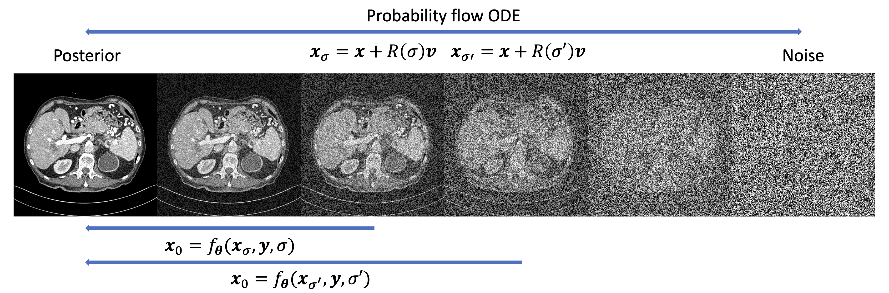

# Poisson Flow Consistency Models <br>

PyTorch implementation of [PFCM: Poisson flow consistency models for
low-dose CT image denoising](https://arxiv.org/abs/2402.08159) by Dennis Hein, Grant Stevens, Adam Wang, and Ge Wang (to appear in IEEE TMI). 

Abstract: X-ray computed tomography (CT) is widely used for medical diagnosis and treatment planning; however, concerns about ionizing radiation exposure drive efforts to optimize image quality at lower doses. This study introduces Poisson Flow Consistency Models (PFCM), a novel family of deep generative models that combines the robustness of PFGM++ with the efficient single-step sampling of consistency models. PFCM are derived by generalizing consistency distillation to PFGM++ through a change-of-variables and an updated noise distribution. As a distilled version of PFGM++, PFCM inherit the ability to trade off robustness for rigidity via the hyperparameter D ∈ (0, ∞). A fact that we exploit to adapt this novel generative model for the task of low-dose CT image denoising, via a “task-specific” sampler that “hijacks” the generative process by replacing an intermediate state with the low-dose CT image. While this “hijacking” introduces a severe mismatch—the noise characteristics of low-dose CT images are different from that of intermediate states in the Poisson flow process—we show that the inherent robustness of PFCM at small D effectively mitigates this issue. The resulting sampler achieves excellent performance in terms of LPIPS, SSIM, and PSNR on the Mayo low-dose CT dataset. By contrast, an analogous sampler based on standard consistency models is found to be significantly less robust under the same conditions, highlighting the importance of a tunable D afforded by our novel framework. To highlight generalizability, we show effective denoising of clinical images from a prototype photon-counting system reconstructed using a sharper kernel and at a range of energy levels.



This implementation is build heavily on  [consistency models](https://github.com/openai/consistency_models/) and [PFGM++](https://github.com/Newbeeer/pfgmpp). All models are trained on the [Mayo low-dose CT data](https://www.aapm.org/grandchallenge/lowdosect/). Trained weights for EDM, PFGM++, CM, and PFCM in Table IV are available here:
 * EDM: [edm.pt](https://drive.google.com/file/d/1zrZ5LytOxASjimqB_BfcKsJyhuGXgOyv/view?usp=share_link)
 * PFGM++: [pfgmpp_2048.pt](https://drive.google.com/file/d/1CHpDSH5i9GWjwdWf8hgvEjDHDbm-LeIf/view?usp=share_link)
 * CM: [cd.pt](https://drive.google.com/file/d/1B9JuKSZhNhZXIwdHJFy3OR2Z1yFy1tqo/view?usp=share_link****)
 * PFCM: [pfcd_128.pt](https://drive.google.com/file/d/1YoKtSi5_S6w8RvZtPO5dIc9n4lxDtZmG/view?usp=share_link)

# Dependencies

To install with Docker, run the following commands:
```sh
cd docker && make build 
```

# Model sampling
The following commands are used for the results in Table IV: 
```
# EDM
python image_sample.py --training_mode edm --generator determ-indiv --batch_size 1 \
      --sigma_max 380 --sigma_min 0.002 --s_churn 0 --steps 40 --sampler heun_h \
      --model_path edm.pt --attention_resolutions 32,16,8 --class_cond False --dropout 0 \
      --image_size 256 --num_channels 256 --num_head_channels 64 --num_res_blocks 2 \
      --num_samples 1 --resblock_updown True --use_fp16 True --use_scale_shift_norm False \
      --weight_schedule karras --minmax train_mayo_1_alt_minmax --data val_mayo_1_alt

# PFGM++ (D=2048)
python image_sample.py --training_mode edm --generator determ-indiv --batch_size 1 \
      --sigma_max 380 --sigma_min 0.002 --s_churn 0 --steps 40 --sampler heun_h \
      --model_path pfgmpp_2048.pt --attention_resolutions 32,16,8  \
      --class_cond False --dropout 0 --image_size 256 --num_channels 256 --num_head_channels 64 \
      --num_res_blocks 2 --num_samples 1 --resblock_updown True --use_fp16 True \
      --use_scale_shift_norm False --weight_schedule karras --minmax train_mayo_1_alt_minmax \
      --aug_dim 2048 --data val_mayo_1_alt

# CD
python image_sample.py --batch_size 1 --generator determ-indiv --training_mode consistency_distillation \
      --sampler onestep_h --model_path ./tmp/cd/model300000.pt --attention_resolutions 32,16,8 \
      --class_cond False --use_scale_shift_norm False --dropout 0.0 --image_size 256 --num_channels 256 \
      --num_head_channels 64 --num_res_blocks 2 --num_samples 1 --resblock_updown True \
      --use_fp16 True --weight_schedule uniform --minmax train_mayo_1_alt_minmax \
      --sigma_max 380 --data val_mayo_1_alt

# PFCD (D=128, with task-specific)
python image_sample_hijack.py --batch_size 1 --generator determ-indiv --training_mode consistency_distillation \
      --sampler onestep_hijack --model_path ./tmp/pfcd_128/model300000.pt --attention_resolutions 32,16,8 \
      --class_cond False --use_scale_shift_norm False --dropout 0.0 --image_size 256 --num_channels 256 \
      --num_head_channels 64 --num_res_blocks 2 --num_samples 1 --resblock_updown True --use_fp16 True \
      --weight_schedule uniform --minmax train_mayo_1_alt_minmax --aug_dim 128 --sigma_max 380 \
      --hijack 30 --weight 0.7 --data val_mayo_1_alt

```

# Model training
PFCM are obtained in two steps. First, train a PFGM++ and then distill it into PFCM via consistency distillation. To train using four GPUS run: 
```
# PFGM++
mpiexec -n 4 python edm_train.py --attention_resolutions 32,16,8 --class_cond False --dropout 0.1 --ema_rate 0.999,0.9999,0.9999432189950708 \
--global_batch_size 4 --image_size 256 --lr 0.0001 --num_channels 256 --num_head_channels 64 --num_res_blocks 2 --resblock_updown True \
--schedule_sampler lognormal --use_fp16 True --use_scale_shift_norm False --weight_decay 0.0 --weight_schedule karras \
--data_dir ./datasets/train_mayo_1_alt/HD/ --aug_dim=2048 --sigma_max 380

# PFCM 
mpiexec -n 4 python cm_train.py --training_mode consistency_distillation --sigma_max 380 --sigma_min 0.002 --target_ema_mode fixed \
--start_ema 0.95 --scale_mode fixed --start_scales 40 --total_training_steps 600000 --loss_norm lpips --lr_anneal_steps 0 \
--teacher_model_path pfgmpp.pt --attention_resolutions 32,16,8 --class_cond False --use_scale_shift_norm False --dropout 0.0 \
--teacher_dropout 0.1 --ema_rate 0.9999,0.99994,0.9999432189950708 --global_batch_size 4 --image_size 256 --lr 0.00001 \
--num_channels 256 --num_head_channels 64 --num_res_blocks 2 --resblock_updown True --schedule_sampler uniform --use_fp16 True \
--weight_decay 0.0 --weight_schedule uniform --data_dir ./datasets/train_mayo_1_alt/HD/ --aug_dim 2048
```


# Citation

If you find this method and/or code useful, please consider citing

```bibtex
@misc{hein2025pfcm,
      title={PFCM: Poisson flow consistency models for low-dose CT image denoising}, 
      author={Dennis Hein and Grant Stevens and Adam Wang and Ge Wang},
      year={2025},
      eprint={2402.08159},
      archivePrefix={arXiv},
      primaryClass={eess.IV},
      url={https://arxiv.org/abs/2402.08159}, 
}
```
